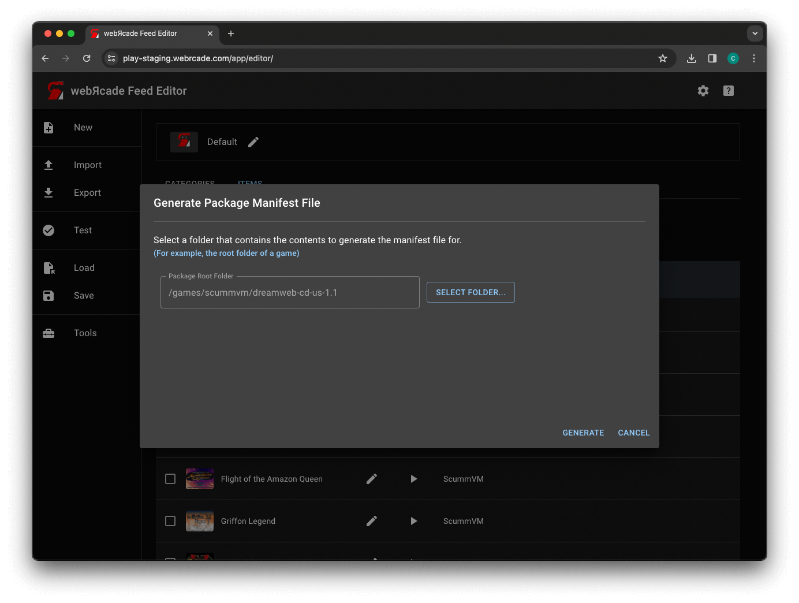

# Generate Package Manifest File

The "Generate Package Manifest File" tool generates and stores a webЯcade [package archive manifest](../../advanced/archive-manifests.md) file for content that already exists within [cloud storage](../../../storage/). The generated manifest file will be written at the root of the selected folder.

While this tool shares some similarities to the [Repackage Archive](../tools/repackage-archive.md) tool, in practice it operates quite differently. This tool simply examines the content under an existing folder in cloud storage and then generates and persists a manifest file.

By contrast, the [Repackage Archive](../tools/repackage-archive.md) tool takes as input an existing archive file, optimizes it for minimized memory use in the browser, writes the resulting files to cloud storage, and then generates a manifest for the newly created files.

!!! important
    The "Generate Package Manifest File" tool is only available if [cloud storage](../../../storage/) has been enabled.

### Generate Manifest Dialog

The following dialog is used to configure and execute the generate manifest operation.

{: style="padding:5px 15px;" class="center zoomD"}

The dialog includes the following options:

| __Field__ | __Description__ |
| --- | --- |
| Package root folder | The folder within cloud storage to generate a package manifest file for. |

### Select Cloud Folder Dialog

The "Select Cloud Folder" dialog is used to select the folder in cloud storage to generate a manifest file for.

{: style="padding:5px 15px;" class="center zoomD"}

The dialog includes the following options:

| __Field__ | __Description__ |
| --- | --- |
| Cloud Folder Tree | Used to select the folder within [cloud storage](../../storage/index.md)to generate a manifest file for.  |

!!! important
    The folder must be a sub-folder beneath `Apps/webrcade` for Dropbox. This is the only portion
    of the Dropbox hierarchy that webЯcade has permission to write the resulting manifest file to.

### Results

If the generate manifest operation completes successfully, a dialog similar to the following will be displayed.

{: style="padding:5px 15px;" class="center zoomD"}

The URL displayed is the webЯcade package archive manifest (`.json`) file in cloud storage that was created as a
result of the generate manifest operation. The `COPY` button copies this URL to the clipboard. It can be used
directly in the `Package Archive or Package Manifest (URL)` field on the `Properties` tab of an archive-based
item (For example, [Quake](../../../apps/engines/quake/) or [ScummVM](../../../apps/engines/scummvm/)).

If for some reason, you forget to copy the URL, it can be found within the cloud storage folder you selected.